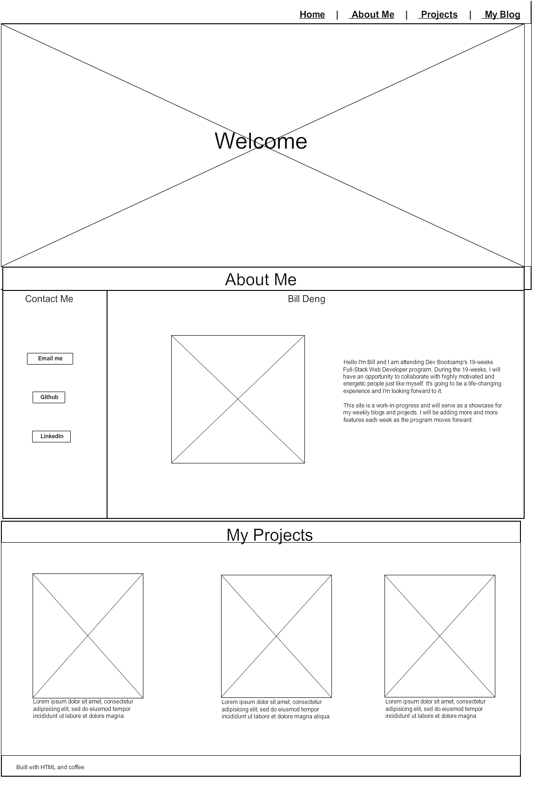

## Wireframe of Site Index

## Wireframe of Blog

#### What is a wireframe?
Wireframe is the blueprint of a website, it allows you to define the 
hierarchy of the design and plan the layout according to how you want the 
user to process the information. 

#### What are the benefits of wireframing?
Wireframing allows you to plan the layout and interaction of an interface
without being distracted by colors and typeface choices or spending countless
hours on changing the actual site. 

#### Did you enjoy wireframing your site?
I have a general idea of how I wanted my site to look like before wireframing so that 
helped. However, if I didn't then I can imagine myself spending a lot of time on this. So 
I wonder if it makes better sense to use a wireframe template then customize it to fit 
our projects. 

#### Did you revise your wireframe or stick with your first idea?
I made a few changes to what I believe were better positions for some of the contents, 
for example I added my blog links on the left section of the second page under my resume but 
it seems that area was cluttered with too much content so I made a separate page for my blog instead.

#### What questions did you ask during this challenge? What resources did you find to help you answer them?
I asked myself many questions including:
1. If I was a user of this page, how would I feel? What would I like or dislike about this site?
2. Does the page flow look right? Does this or that area look right? 
3. What's the best spot for this or that content?
4. Is there too much content? Is there too little content?
5. Does it look easy to navigate? Is it simple to find specific contents?

#### Which parts of the challenge did you enjoy and which parts did you find tedious?
I really enjoyed learning and putting together the wireframe and I think the information provided was just right.
The only thing I didn't enjoy was how slow the site was (it even crashed) and the layout looked
like it could use some work. 
