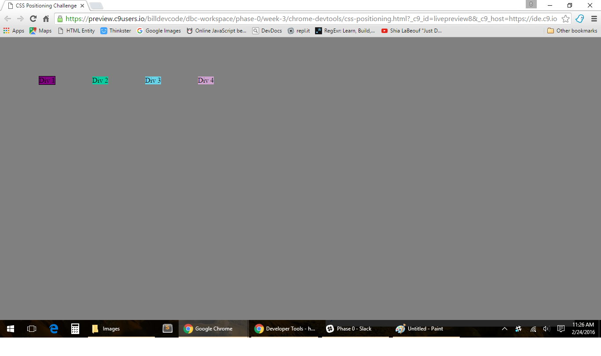
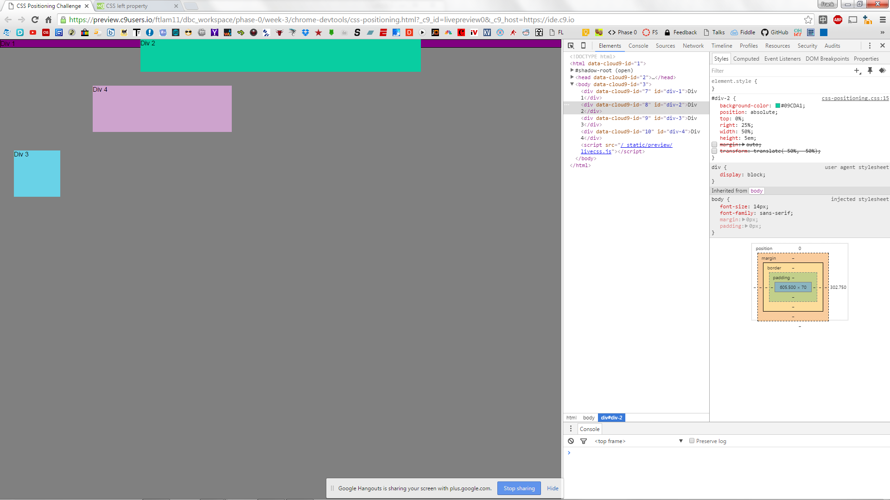

#### How can you use Chrome's DevTools inspector to help you format or position elements?
We can use Chrome DevTools to manipulate the format and positioning right away by inspecting
a specific element's styles. We can see how elements or the whole page changes by 
adding a new property and value or adjusting the current values of a property. 

#### How can you resize elements on the DOM using CSS?
We used `width` and `height` properties and `px`, `em`, and `%` values to resize the `
` element.

#### What are the differences between absolute, fixed, static, and relative positioning? Which did you find easiest to use? Which was most difficult?
* absolute positioning - positioned relative to the nearest positioned ancestor. If there is no
  positioned ancestor, it uses the document body and moves along with page scrolling. 
* fixed positioning - positioned relative to the viewport and always stays in the same place 
  even if the page is scrolled.
* static positioning - the default positioning and it's always positioned according to the normal
  flow of the page. It's also not affected by top, bottom, left and right properties. 
* relative positioning - an element is positioned relative to its normal position. Setting
  top, bottom, left and right properties will cause it to adjust away from its normal position.

I found fixed positioning the easiest to use because it's fixed and always stays in the same place.
On the other hand, I found absolute positioning the most challenging to understand. 

#### What are the differences between margin, border, and padding?
Margin is a transparent area outside the border. Border is a border that goes around the content and padding 
which we can by adding the border property. Lastly padding is a transparent area around the content. 

#### What was your impression of this challenge overall? (love, hate, and why?)
I really enjoyed this challenge because I was stuck on trying to position something on my 
blog page and this challenge helped me better understand what approach I should use to 
solve my problem. Also, on one of the HTML videos last week, the presenter emphasized how important 
and useful Chrome DevTools is in the real-world.