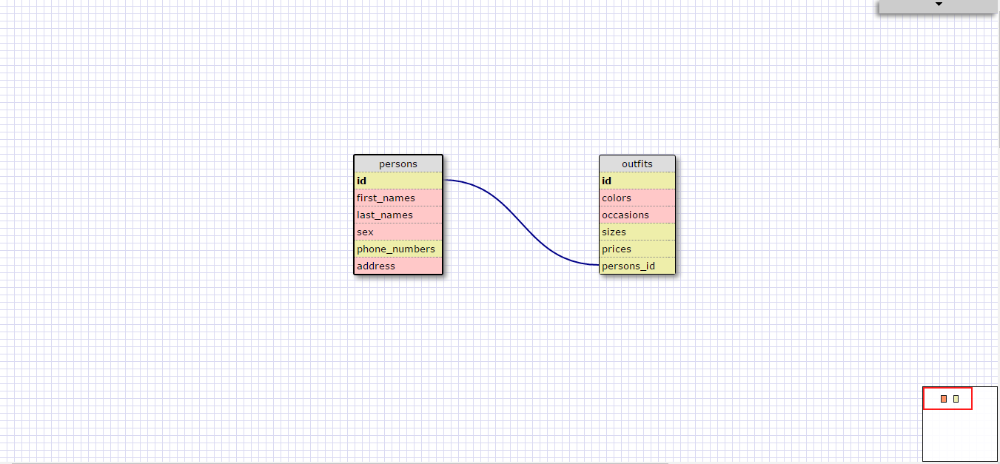

#### 1. Select all data for all states.
`select * from states;`

#### 2. Select all data for all regions.
`select * from regions;`

#### 3. Select the state_name and population for all states.
`select state_name, population from states;`

#### 4. Select the state_name and population for all states ordered by population. The state with the highest population should be at the top.
`select state_name, population from states order by population desc;`

#### 5. Select the state_name for the states in region 7.
`select state_name from states where region_id = 7;`

#### 6. Select the state_name and population_density for states with a population density over 50 ordered from least to most dense.
`select state_name, population_density from states where population_density > 50 order by population_density asc;`

#### 7. Select the state_name for states with a population between 1 million and 1.5 million people.
`select state_name from states where population between 1000000 and 1500000;`

#### 8. Select the state_name and region_id for states ordered by region in ascending order.
`select state_name, region_id from states order by region_id asc;`

#### 9. Select the region_name for the regions with "Central" in the name.
`select region_name from regions where region_name like '%Central';`

#### 10. Select the region_name and the state_name for all states and regions in ascending order by region_id. Refer to the region by name. (This will involve joining the tables).
`select regions.region_name, states.state_name from states join regions on states.region_id = regions.id order by region_id asc;`

## Reflect

#### What are databases for?
Databases are used to store data in a structured way so it can be easily searched and accessed.

#### What is a one-to-many relationship?
A one-to-many relationship is when each row in the related to table can be related to many rows in the relating table. 
For example between Table A and Table B, each row in Table A is linked to 0, 1, or many rows in Table B.

#### What is a primary key? What is a foreign key? How can you determine which is which?
A primary key is the column that uniquely identifies each record in the table. Foreign keys are not necessarily 
unique in the table that stores them but they point to unique values in the referenced table. For example
in my above database, id is the primary key. I have an id in the persons table and an id in the outfits table (these 
are 2 different id's, each person has an unique id and each outfit has an unique id), I also have a person_id in the 
outfits table and this is the foreign key which connects to the id in the persons table so we know which outfit
belongs to which person. 

#### How can you select information out of a SQL database? What are some general guidelines for that?
We can use SQL language to select and manage data stored in relational databases. The major commands in all the 
different versions of SQL are SELECT, UPDATE, DELETE, INSERT, and WHERE. For example, if we wanted to see the 
complete table, we use `SELECT * FROM this_table;`This means we are accessing everything from this_table and we 
add a semi-colon at the end to tell SQL our line of code ends here. 
