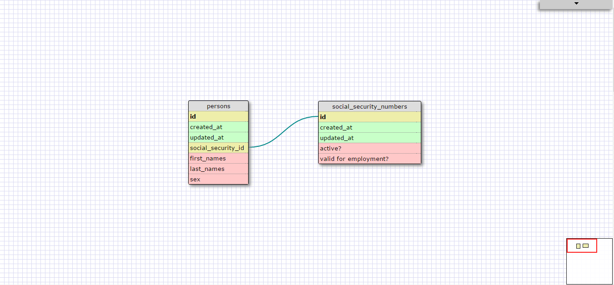
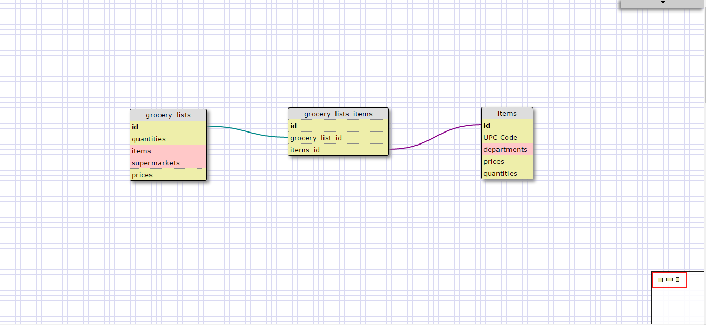

I think this is a one-to-one schema because a person can only have one social security number. 
The number could be active or inactive and there are several versions of a social security number 
so it makes sense to have it's own tables such as some social security are valid for employment 
while some aren't. 

## Reflect

#### What is a one-to-one database?

It's a database where two things have a single relationship to one another. An example is 
each state has one capital city while each capital city belongs to one state. 

#### When would you use a one-to-one database? (Think generally, not in terms of the example you created).

We would generally use it if we have a relationship where a group of fields can all be optionally be empty. 

#### What is a many-to-many database?

It's a database where two things have many relationships with one another. An example is 
a movie theater has many movies showing while a movie is shown in many movie theaters. 

#### When would you use a many-to-many database? (Think generally, not in terms of the example you created).

We would generally use it if we need to know other information that's specific to the instance of when 
the two tables are connected.

#### What is confusing about database schemas? What makes sense?

Overall, I think database schemas are pretty straightforward. We just have to think about the relationship 
between two things and understand how they're connected. Once we figure that out then we know which 
schemas to use. 